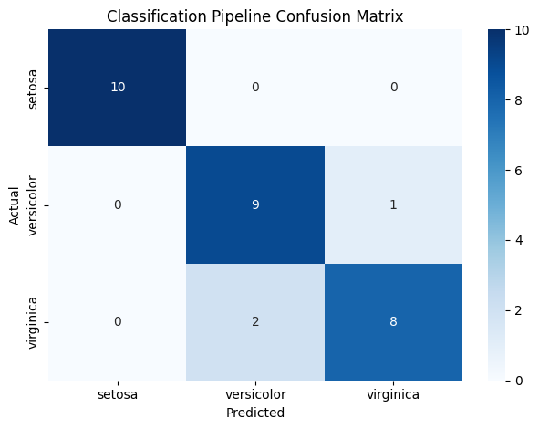
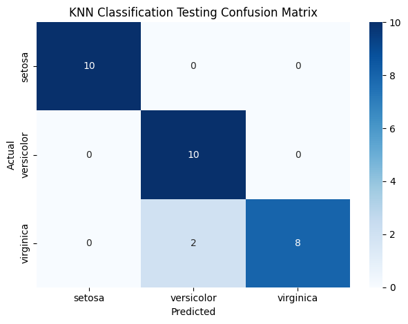

# Machine Learning Pipelines and GridSearchCV

This project demonstrates how to build a complete machine learning classification workflow using Scikit-learn's `Pipeline`, and then improve it using `GridSearchCV` with stratified cross-validation. The dataset used is the classic Iris dataset.

## Project overview

The notebook builds a classification pipeline with three steps:

1. `StandardScaler`
2. `PCA`
3. `KNeighborsClassifier`

The main goal is to show how preprocessing and modeling can be combined into one reusable object, and how hyperparameters of multiple steps can be tuned together in a structured way.

## Original notebook markdown content

### Data loading

data = load_iris()
X, y = data.data, data.target
labels = data.target_names

### Pipeline initialization

Initializing the pipeline that includes:
- StandardScaler
- PCA
- KNeighborsClassifier

### Pipeline interpretation

I consider pipeline as an ML model that can be trained and tested and has three estimators.

### Prediction stage

Getting model predictions

### First confusion matrix

Confusion matrix of KNN model

### First model result comment

The model wrongly classified two viginica irises as versicolor, and one versicolor as virginica. Only three classification errors out of 30 irises on our first attempt!

### Hyperparameter tuning section

### Tuning hyperparameters using a pipeline within cross-validation grid search

Now I try to optimize my pipeline.

### Parameter grid

the grid search will test all combinations of:  
pca__n_components: 2, 3  
knn__n_neighbors: 3, 5, 7  

So it tries:  
(2 PCA components, 3 neighbors)  
(2, 5)  
(2, 7)  
(3, 3)  
(3, 5)  
(3, 7)  

### Cross-validation choice

### Picking a cross validation method

I use scikit-learn's StratifiedKFold cross-validation class so that target is stratified.

### GridSearchCV note

In below codes: best_model is actually the GridSearchCV object, not yet the final fixed KNN model

### Best model fitting

### Finding best GridSearchCV model for training data

it takes:

- the pipeline
- the param_grid
- the cross-validation rule cv=StratifiedKFold(...)

Then it trains and evaluates the model for every parameter combination across the folds, compares the scores, and keeps the best setup.

### Final evaluation

### Evaluating the accuracy of the best model on test date

## Technical workflow

The code follows this structure:

1. Install and import the required libraries.
2. Load the Iris dataset.
3. Split the data into training and testing sets using stratification.
4. Build an initial pipeline containing scaling, dimensionality reduction, and classification.
5. Fit the pipeline on the training data.
6. Evaluate prediction quality on the test set.
7. Compute and visualize a confusion matrix.
8. Rebuild the pipeline in a more flexible form for tuning.
9. Define a hyperparameter grid for PCA and KNN.
10. Use `StratifiedKFold` for cross-validation.
11. Pass the pipeline, parameter grid, and CV object into `GridSearchCV`.
12. Fit the search object to find the best parameter combination.
13. Evaluate the tuned model and visualize its confusion matrix.

## Why pipeline is useful

A pipeline is a structured machine learning workflow that chains several steps into a single object. In this notebook, the steps are scaling, PCA, and KNN classification.

This is useful because:

- the same preprocessing used during training is applied during prediction
- the workflow becomes cleaner and easier to manage
- hyperparameters from different stages can be tuned together
- steps can be replaced, skipped, or modified easily

In Scikit-learn, pipeline parameters are accessed using the format:

`step_name__parameter_name`

For example:

- `pca__n_components`
- `knn__n_neighbors`

This makes the pipeline easy to modify and search over systematically.

## Model explanations

### StandardScaler

`StandardScaler` standardizes each feature so that it has mean 0 and standard deviation 1.

For a feature value `x`, the transformed value is:

`z = (x - mu) / sigma`

where:

- `mu` is the feature mean
- `sigma` is the feature standard deviation

This is important for KNN and PCA because both are sensitive to scale. If one feature has much larger numeric values than another, it can dominate the distance calculations and variance structure.

### PCA

Principal Component Analysis reduces the number of input dimensions while preserving as much variance as possible.

PCA constructs new variables called principal components, which are linear combinations of the original features. These new directions are chosen so that:

- the first component captures the largest possible variance
- the second captures the next largest variance
- each new component is orthogonal to the previous ones

If the original feature vector is `x`, a reduced representation is obtained by projecting onto principal directions:

`z = W^T x`

where:

- `x` is the original feature vector
- `W` is the matrix of selected principal component directions
- `z` is the lower-dimensional representation

In this notebook, PCA is used with either 2 or 3 components during tuning.

### K-Nearest Neighbors

KNN is a non-parametric classification algorithm. To classify a test point, it finds the `k` closest training points and predicts the majority class among them.

Distance is often measured using Euclidean distance:

`d(x, y) = sqrt(sum_i (x_i - y_i)^2)`

where `x` and `y` are two samples.

The hyperparameter `k` controls how many neighbors vote. Smaller `k` can make the model more sensitive to noise, while larger `k` can smooth the decision boundary.

In this notebook, the tested values are:

- `k = 3`
- `k = 5`
- `k = 7`

## Grid search and cross-validation

`GridSearchCV` tries all combinations in a parameter grid and evaluates them using cross-validation.

Here the parameter grid is:

- `pca__n_components = [2, 3]`
- `knn__n_neighbors = [3, 5, 7]`

So the total number of parameter combinations is:

`2 x 3 = 6`

The cross-validation method is `StratifiedKFold` with 5 splits. Since there are 6 candidate settings and 5 folds, the total number of model fits is:

`6 x 5 = 30`

Stratification means each fold approximately preserves the class proportions of the target labels.

The search process returns:

- the best parameter combination
- the best cross-validation score
- the best estimator

A key implementation detail is that `best_model` is the `GridSearchCV` object itself during fitting. After fitting, the final tuned pipeline is stored inside:

`best_model.best_estimator_`

## Evaluation

The notebook evaluates the model in two stages:

1. initial pipeline performance
2. tuned pipeline performance after grid search

The main metric used is classification accuracy:

`accuracy = (number of correct predictions) / (total number of predictions)`

The notebook also uses confusion matrices to show exactly which species were predicted correctly and where errors occurred.

## Figures

### Initial pipeline confusion matrix

This figure shows the confusion matrix of the first pipeline before hyperparameter tuning. Most predictions are correct. The main classification errors occur between versicolor and virginica, which is expected because these two classes are less cleanly separated than setosa.

### Tuned KNN pipeline confusion matrix

This figure shows the confusion matrix of the tuned pipeline after `GridSearchCV`. The tuned model keeps perfect classification for setosa and improves the overall decision process by selecting the best combination of PCA components and number of neighbors through cross-validation.

## Summary

This project shows how to:

- build a clean machine learning workflow with `Pipeline`
- standardize data before distance-based learning
- reduce dimensionality with PCA
- classify Iris samples with KNN
- search over multiple hyperparameters using `GridSearchCV`
- preserve class balance with `StratifiedKFold`
- evaluate results using accuracy and confusion matrices

Overall, the notebook is a compact example of how preprocessing, dimensionality reduction, model fitting, and hyperparameter tuning can be integrated into one reproducible classification workflow.
